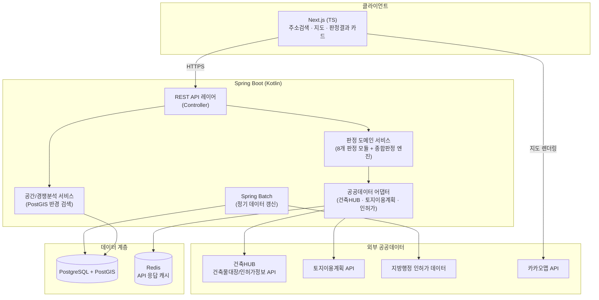
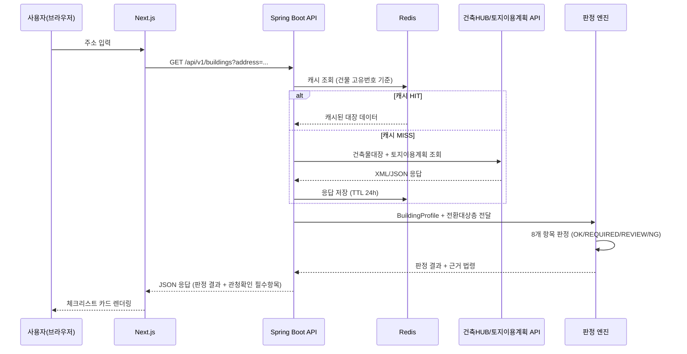
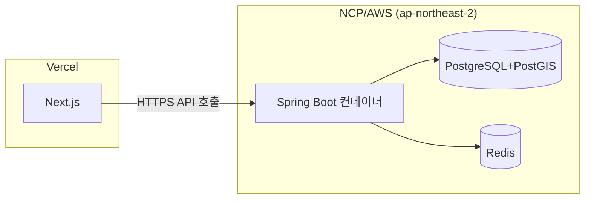

# 시스템 아키텍처 설계 (1.3)

> 호스텔 용도변경 1차 스크리닝 서비스 — MVP 아키텍처
> 관련 스킬: hostel-use-change-screening (8개 판정 항목 로직의 코드화가 이 아키텍처의 핵심 목적)

## 1. 설계 원칙

- **판정 로직은 순수 도메인 계층으로 분리한다.** 법령이 개정되면 규칙 테이블/서비스만 바뀌어야 하고, 컨트롤러나 인프라 코드에 손대지 않아야 한다.
- **외부 공공데이터 API는 항상 어댑터 뒤에 둔다.** 건축HUB·토지이용계획·인허가 데이터의 응답 형식(XML/JSON)이 바뀌어도 도메인 로직이 깨지지 않도록 포트-어댑터(헥사고날) 패턴을 따른다.
- **결측값이 정상 상태다.** 실제 건축물대장에서도 하수처리시설·주차장 정보가 공란인 경우가 흔했다(9/10 남포동 사례). null을 예외가 아니라 "REVIEW 대상"이라는 도메인 신호로 다룬다.
- **캐시는 신뢰 경계에 둔다.** 공공데이터 API 쿼터를 아끼기 위해 캐싱하되, 판정 결과 자체는 캐시하지 않는다(규칙이 바뀌면 재판정되어야 하므로).

## 2. 컴포넌트 다이어그램



## 3. 요청 흐름 — "주소 입력 → 판정 결과" 시퀀스



## 4. 레이어 구조 (백엔드)

```
com.hostelscreening
├── api                 # Controller, DTO (요청/응답)
├── domain
│   ├── building        # BuildingProfile, 층별현황 등 핵심 모델
│   ├── screening        # 8개 판정 모듈 + 종합판정 엔진 (순수 도메인, 외부 의존 없음)
│   └── spatial          # 반경검색, 경쟁현황 도메인
├── adapter
│   ├── publicdata       # 건축HUB/토지이용계획/인허가 API 클라이언트
│   └── cache            # Redis 어댑터
├── infra
│   ├── persistence       # JPA 엔티티, Repository
│   └── batch             # Spring Batch Job/Step
└── config                # 보안, WebClient, 배치 스케줄 설정
```

이 구조를 선택한 이유: `domain/screening`이 어떤 프레임워크에도 의존하지 않게 만들어야, 나중에 법령이 바뀌었을 때 이 모듈만 단위테스트로 검증하고 배포할 수 있습니다. (7.1 단위테스트 작업이 이 계층을 직접 겨냥합니다.)

## 5. 배포 뷰 (MVP)



- 프론트: Vercel (2.7 배포 환경 구성과 연결)
- 백엔드: 컨테이너(Docker) 기반 배포, 국내 리전 우선(공공데이터 API 응답 지연 최소화)

## 6. 다음 문서와의 연결

- 이 아키텍처의 `infra/persistence` 계층 → **1.4 DB 스키마 설계**에서 실제 테이블/PostGIS 컬럼으로 구체화
- `api` 레이어의 Controller 계약 → **1.5 API 명세**에서 OpenAPI로 구체화
- `Browser` 쪽 화면 흐름 → **1.6 와이어프레임**에서 시각화
